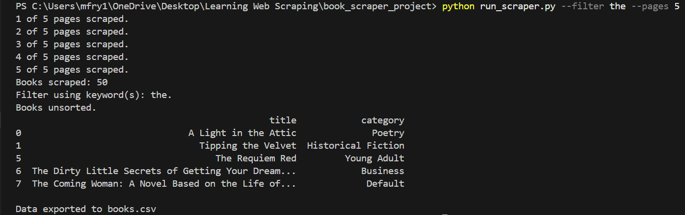
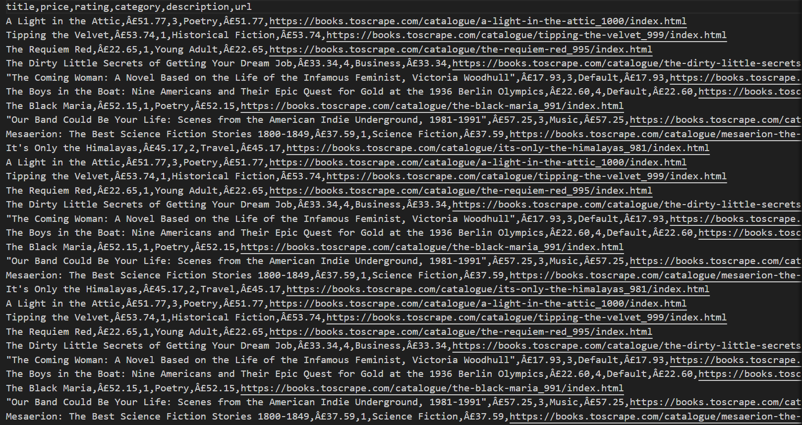
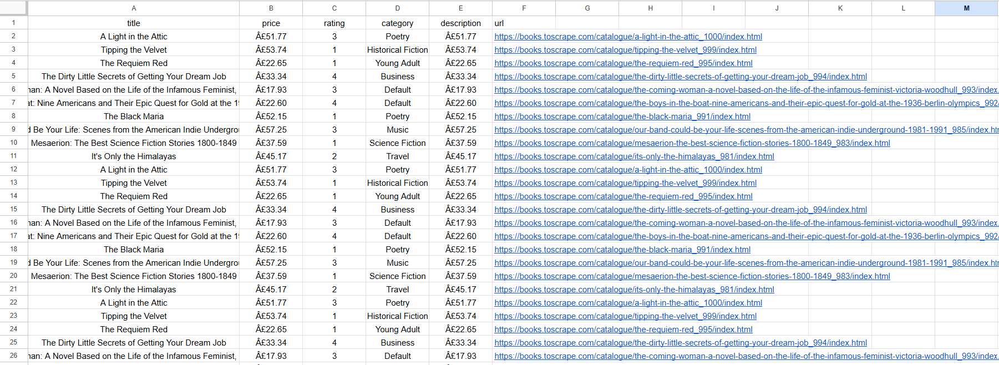

# 🧠 CLI Web Scraper for Book Website

> Web scraper for https://books.toscrape.com/ with CLI configurable options including filtering, sorting, and number of pages to scrape.

---

## 📜 Table of Contents

- [About](#about)
- [Features](#features)
- [Screenshots](#screenshots)
- [Installation](#installation)
- [Usage](#usage)
- [Project Structure](#project-structure)
- [Technologies Used](#technologies-used)
- [Contact](#contact)

---

## 📖 About

This project is a CLI configurable web scraper that gathers a user inputted number of pages of book data, including title, price, rating, category, description, and URL. This data then has any applicable sorting and/or filtering applied to it based on the CLI arguments passed by the user. The data is summarized in the command line and exported to a CSV file. This exists as a practice project and showcase of my web scraping skills.

---

## ✅ Features

- [x] CLI arguments
- [x] User input # pages to scrape
- [x] Scrape job progress status
- [x] Keyword(s) filtering
- [x] Sorting (Rating, Price)
- [x] Data summarizing
- [x] Exporting to CSV

---

## 📸 Screenshots

  



---

## ⚙️ Installation

1. Clone the repository:

    ```bash
    git clone https://github.com/mfry1199/cli_book_scraper.git
    cd cli_book_scraper
    ```

2. (Optional) Create a virtual environment:

    ```bash
    python -m venv venv
    source venv/bin/activate  # or venv\Scripts\activate on Windows
    ```

3. Install dependencies:

    ```bash
    pip install -r requirements.txt
    ```

---

## 🚀 Usage

### ▶️ Option 1: Run using helper script (Recommended)

```bash
python run_scrapy.py [--sort {rating,price}] [--desc | --asc] [--filter KEYWORD(s)] [--pages N]
```

#### ✅ Examples

```bash
# Sort by rating in descending order (default)
python run_scrapy.py --sort rating

# Sort by price in ascending order
python run_scrapy.py --sort price --asc

# Filter results by the keyword "laptop"
python run_scrapy.py --filter laptop

# Filter results by multiple keyword "Great Gatsby"
python run_scrapy.py --filter 'Great Gatsby'

# Scrape 5 pages, sorted by rating
python run_scrapy.py --sort rating --pages 5
```

### ▶️ Option 2: Run as a Python package

```bash
python -m book_scraper [--sort {rating,price}] [--asc | --desc] [--filter KEYWORD] [--pages N]
```

This uses the `__main__.py` file in the package directory and works exactly like the helper script.

---

### ▶️ Option 3: Import as a module

You can also import components into another Python script:

```python
from book_scraper.scraper import scrape_books
from book_scraper.sorter import sort_books
```

### 🔧 Arguments

| Flag           | Description                                                                 |
|----------------|-----------------------------------------------------------------------------|
| `--sort`       | Sort the output by either `rating` or `price`. Optional.                    |
| `--desc`       | Sort in descending order (default). Mutually exclusive with `--asc`.        |
| `--asc`        | Sort in ascending order. Overrides `--desc` if both are given.              |
| `--filter`     | Filter the data based on a keyword or keywords. Optional.                   |
| `--pages`      | Number of pages to scrape (default is 1). Optional.                         |

### ✨ Tips

- If neither `--asc` nor `--desc` is specified, it defaults to descending.
- All arguments are optional — the script will run with default values if none are provided.

## 🗂 Project Structure

```text
/cli_book_scraper
│   README.md
│   requirements.txt
│   run_scraper.py
│
├───book_scraper
│       cli.py
│       df_filter.py
│       scraper.py
│       sorter.py
│       __init__.py
│       __main__.py
│
└───images
        csv_output.png
        excel_output.png
        terminal_output.png
```

---

## 🛠 Technologies Used

- Python 3.12.5
- Pandas
- BeautifulSoup
- Requests
- Argparse
- Re

---

## 📬 Contact

Created by **Michael Fry**  
📧 Email: michael.fry.contact@gmail.com  
📂 GitHub: [@mfry1199](https://github.com/mfry1199)